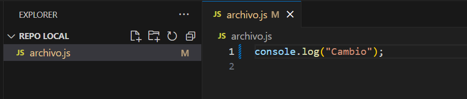

# Laboratorio Git

**1. Crear un repositorio en local**

- Abre tu terminal y navega hasta el directorio donde deseas crear el repositorio.
- Crea una carpeta con el nombre del repositorio.

    

- Ingresa a la carpeta que acabas de crear.

    

- Inicializa el repositorio de Git.

    

**2. Subir el repositorio a GitHub**

- Crea un nuevo repositorio en GitHub.

    
    

- Copia el URL del repositorio que acabas de crear en GitHub

    

- Conecta tu repositorio local con el repositorio en GitHub.

    

- Verifica que la conexión se haya establecido correctamente.

    

**3. Hacer un commit y un push**

- Crea un archivo en la carpeta del repositorio.

    
    

- Añade el archivo al staging.

    

- Crea un commit con un mensaje descriptivo.

    

- Sube los cambios al repositorio en GitHub.

    
    

**4. Crear una rama**

- Crea una rama nueva llamada "development".

    

- Cambia a la nueva rama.

    

- Realiza algunos cambios en el archivo que creaste.

    

- Añade y haz un commit con los cambios en la rama "development".

    

- Sube los cambios a Github.

    

**5. Hacer un merge**

- Vuelve a la rama "main".

    

- Haz un merge de la rama "development" a la rama "main".

    

- Si no hay conflictos, los cambios realizados en la rama "development" se incorporarán a la rama "main".

    

- Haz un push de los cambios al repositorio en GitHub.

    
